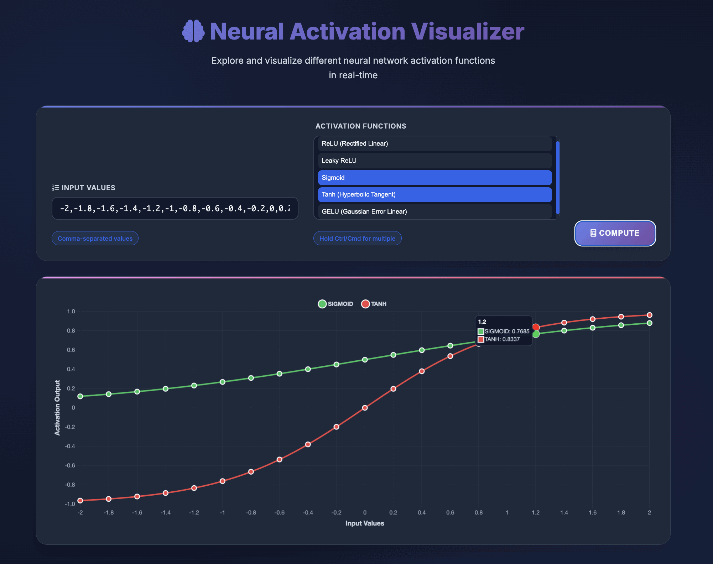

# Neural Network Activation Function Playground

A web-based interactive tool for visualizing and exploring neural network activation functions in real-time.



## Overview

This project provides an intuitive interface to understand and compare different activation functions commonly used in neural networks. Users can input custom values and see how various activation functions transform these inputs, helping to build intuition about their behavior and characteristics.

## Features

- **Interactive Visualization**: Real-time plotting of activation function outputs
- **Multiple Function Support**: Compare different activation functions side-by-side
- **Supported Activation Functions**:
  - ReLU (Rectified Linear Unit)
  - Leaky ReLU
  - Sigmoid
  - Tanh (Hyperbolic Tangent)
  - GELU (Gaussian Error Linear Unit)
- **Custom Input Values**: Enter your own input values to see how activations respond
- **Responsive Design**: Works on desktop and mobile devices

## Workflow

The project consists of:

1. **Backend API** (FastAPI):
   - Implements activation functions in Python using NumPy
   - Provides a REST API endpoint for computing activation outputs
   - Handles single-layer neural network computations

2. **Frontend Interface**:
   - Modern, responsive UI built with HTML, CSS, and JavaScript
   - Interactive charts using Chart.js
   - Real-time API communication

## Getting Started

### Prerequisites

- Python 3.7+
- FastAPI
- NumPy

### Installation

1. Clone this repository
2. Install dependencies:
   ```
   pip install -r requirements.txt
   ```
   or
   ```
   pip install -e .
   ```

### Running the Application

1. Start the FastAPI server:
   ```
   python main.py
   ```
   or
   ```
   uvicorn main:app --reload
   ```

2. Open your browser and navigate to:
   ```
   http://localhost:8000
   ```

## How to Use

1. Enter input values as comma-separated numbers (e.g., `-5,-4,-3,-2,-1,0,1,2,3,4,5`)
2. Select one or more activation functions to visualize
3. Click "Compute" to see the results
4. The chart will display how each activation function transforms the input values

## Why Activation Functions Matter

Activation functions introduce non-linearity into neural networks, allowing them to learn complex patterns. Understanding their behaviors helps in:

- Selecting appropriate functions for different network architectures
- Addressing issues like vanishing/exploding gradients
- Optimizing network training and performance
